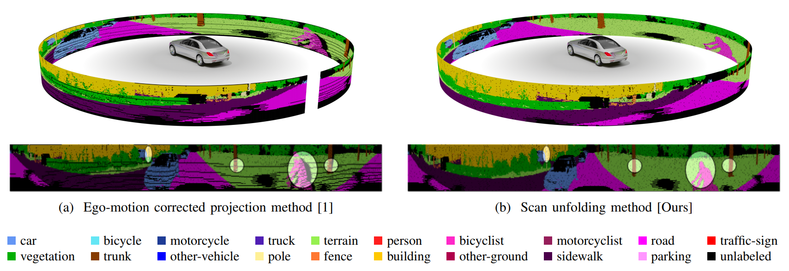

# KITTI Scan Unfolding

Python implementation of KITTI scan unfolding.

**_The code is currently not available on this repository.
Feel free to contact me in case you have any questions._**

We propose KITTI scan unfolding in our paper
[Scan-based Semantic Segmentation of LiDAR Point Clouds: An Experimental Study](https://arxiv.org/pdf/2004.11803.pdf).
If you use this code or the algorithm described in the paper, please make sure to [cite](#citation) this paper.


Fig. 1: **Cylindrical point cloud projection**:
(a) Correcting for ego-motion leads to a projection that suffers from systematic
point occlusions as some 3D points are projected into occupied pixels.
Hidden points can not provide any information to the network and may not be accurately classified.
(b) The scan unfolding method provides a dense projection without systematic discretization artifacts.

## Citation
```
@article{triess2020,
    title={{Scan-based Semantic Segmentation of LiDAR Point Clouds: An Experimental Study}},
    author={Triess, Larissa T. and Peter, David and Rist, Christoph B. and Z\"ollner, J. Marius},
    journal={arxiv},
    year={2020}
}
```

## Links
* [Paper](https://arxiv.org/pdf/2004.11803.pdf)
* [Project page](http://ltriess.github.io/scan-semseg)

## References

[1] A. Milioto et al., “RangeNet++: Fast and Accurate LiDAR Semantic Segmentation,”
in IEEE/RSJ Intl. Conf. on Intelligent Robots and Systems (IROS), 2019.
